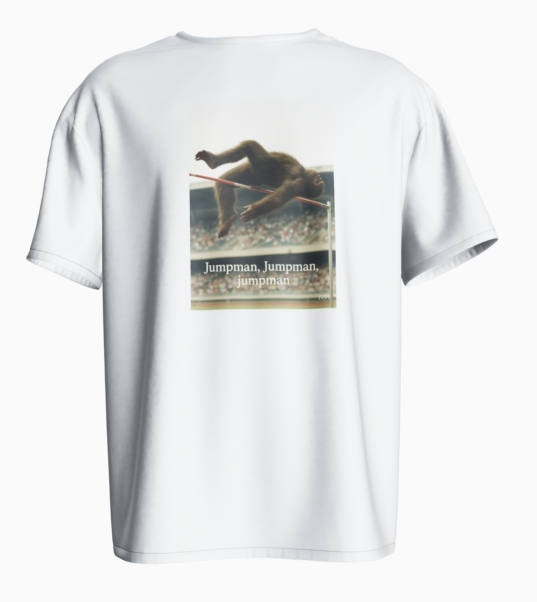

# InstaShirt

AI-powered shirt design generator that creates custom graphics for your t-shirts.

## Quick Start

1. Install dependencies: `pnpm install`
2. Start development server: `pnpm dev`
3. Open http://localhost:5173

## Example

The app will generate a unique design based on your description and display it on a 3D shirt model that you can customize with different colors and placements.

## Features

- AI-powered image generation
- 3D shirt preview
- Prompt history
- Design history
- Multiple shirt colors
- Texture placement options (front/back/full)
